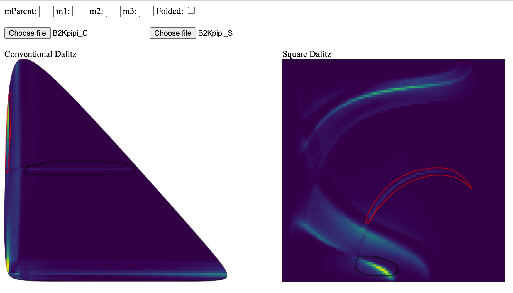

# Square. Practical. Good.

A tool to visualise drawn regions in the conventional Dalitz plot as regions in the 'square' Dalitz plot, and vice versa.

A live version can be found [here](https://dpohanlon.github.io/squareDalitzVis/sqDalitzVis.html).

  

Usage
---

* Optionally set parent and final state hadron masses (by default these are set to B+ -> Kpipi), and whether this is a 'folded' Dalitz plot.

* Select (local) conventional and square Dalit plot images that correspond to each other. So far only m_13^2 vs m_23^2 plots are supported These need to be images where the Dalitz plot goes to the edges of the figure, so without axis labelling or whitespace. The quickest way is probably to take a screenshot of a real plot (an example for B+ -> Kpipi can be found [here](https://github.com/dpohanlon/squareDalitzVis/tree/main/examples)).

* Draw!
